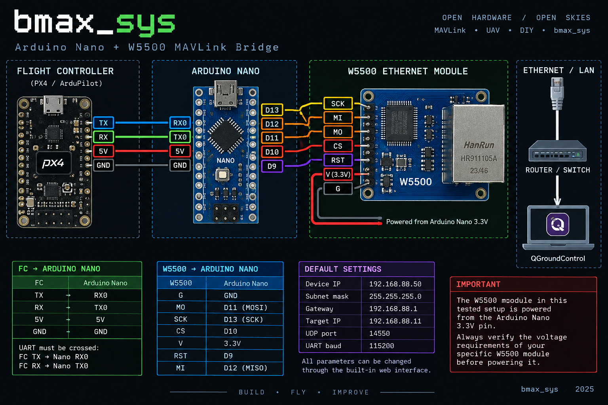
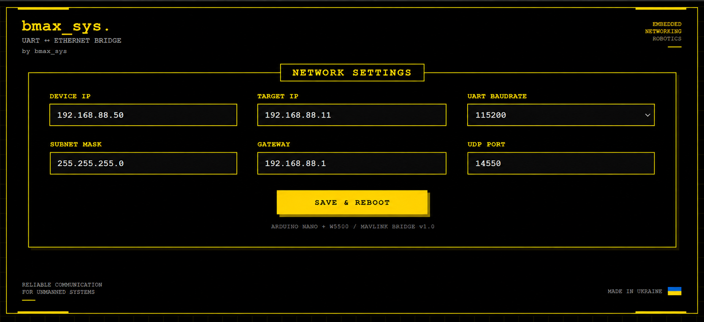

<p align="center">
  
</p>

# Arduino Nano + W5500 MAVLink Bridge

**UART ↔ Ethernet bridge for MAVLink telemetry based on Arduino Nano and W5500.**

Built by `bmax_sys`.

## Overview

This project turns an Arduino Nano and W5500 Ethernet module into a bidirectional UART-to-Ethernet bridge for MAVLink communication.

The flight controller sends MAVLink data through UART to the Arduino Nano. The Nano forwards the data through the W5500 Ethernet module using UDP.

Communication works in both directions:

`Flight Controller ↔ UART ↔ Arduino Nano ↔ W5500 ↔ Ethernet/UDP ↔ QGroundControl`

The device also includes a built-in web interface for changing network and UART settings without modifying or recompiling the firmware.

## Features

- Bidirectional `UART ↔ UDP` MAVLink bridge
- Arduino Nano + W5500 Ethernet
- Built-in web configuration interface
- Configurable Device IP
- Configurable Target IP
- Configurable Subnet Mask
- Configurable Gateway
- Configurable UDP port
- Configurable UART baud rate
- Settings stored in EEPROM
- Save & automatic reboot from the web interface
- Default MAVLink UDP port `14550`
- Works with QGroundControl
- Designed for wired Ethernet telemetry

  ## Hardware

The tested prototype uses:

- Arduino Nano
- W5500 Ethernet module
- ArduPilot-compatible flight controller
- Ethernet cable
- UART connection between the flight controller and Arduino Nano

### Connections

**Flight Controller → Arduino Nano**

`TX → RX0`  
`RX → TX0`  
`5V → 5V`  
`GND → GND`

**W5500 → Arduino Nano**

`MO → D11`  
`MI → D12`  
`SCK → D13`  
`CS → D10`  
`RST → D9`  
`V → 3.3V`  
`G → GND`

For the complete wiring description, see:

[`docs/WIRING.md`](docs/WIRING.md)

## Default Configuration

The firmware starts with the following default settings:

| Parameter | Default value |
|---|---|
| Device IP | `192.168.88.50` |
| Subnet Mask | `255.255.255.0` |
| Gateway | `192.168.88.1` |
| Target IP | `192.168.88.11` |
| UDP Port | `14550` |
| UART Baud Rate | `115200` |

The settings can be changed through the built-in web interface and are stored in EEPROM.

After changing the configuration, press **SAVE & REBOOT** to store the new settings and restart the device.

## Web Interface

<p align="center">
  
</p>

The bridge includes a lightweight built-in web interface hosted directly by the Arduino Nano.

Open the device IP address in a web browser:

`http://192.168.88.50`

The interface allows you to configure:

- Device IP
- Target IP
- UART baud rate
- Subnet mask
- Gateway
- UDP port

After pressing **SAVE & REBOOT**, the configuration is stored in EEPROM and the Arduino Nano automatically restarts with the new settings.

The public version of the interface uses the `bmax_sys` pixel-style branding.

## MAVLink and QGroundControl

The bridge was designed for MAVLink telemetry between an ArduPilot flight controller and QGroundControl.

Default data path:

`Flight Controller → UART → Arduino Nano → W5500 → UDP 14550 → QGroundControl`

Communication is bidirectional:

`QGroundControl → UDP → W5500 → Arduino Nano → UART → Flight Controller`

By default, MAVLink packets are sent to:

`192.168.88.11:14550`

The Target IP and UDP port can be changed from the web interface, allowing the bridge to work with different network configurations.

## Firmware

The firmware is available here:

[`firmware/arduino_nano_w5500_mavlink_bridge.ino`](firmware/arduino_nano_w5500_mavlink_bridge.ino)

Main firmware functions:

- UART → UDP forwarding
- UDP → UART forwarding
- W5500 Ethernet initialization
- Web configuration server
- EEPROM configuration storage
- IP address validation
- Configurable UART baud rate
- Automatic reboot after saving settings

The firmware is based on the Arduino Ethernet library and is designed to keep memory usage low enough for the Arduino Nano.

## Repository Structure

```text
arduino-nano-w5500-mavlink-bridge/
├── README.md
├── firmware/
│   └── arduino_nano_w5500_mavlink_bridge.ino
├── docs/
│   └── WIRING.md
└── images/
    ├── wiring-diagram.png
    └── web-interface.png
```


## Tested

The prototype has been tested with real hardware.

Confirmed:

- Arduino Nano communicates with the W5500 over SPI
- Flight controller communicates with the Nano over UART
- MAVLink telemetry is transmitted over Ethernet
- UDP communication works in both directions
- QGroundControl receives MAVLink telemetry
- Web configuration interface works
- Network settings can be changed and stored in EEPROM
- Device automatically reboots after saving settings

This repository documents a working hardware prototype, not only a theoretical design.
For detailed test results and verification steps, see:

[`docs/TESTING.md`](docs/TESTING.md)

## Important Notes

- Always connect UART lines crossed: `FC TX → Nano RX0` and `FC RX → Nano TX0`.
- Flight controller and Arduino Nano must share a common GND.
- The tested W5500 module is powered from the Arduino Nano `3.3V` pin.
- Verify the power requirements of your specific W5500 module before connecting it.
- Make sure the configured Target IP points to the computer running QGroundControl.
- UDP port `14550` is the default MAVLink port used in this project.

  ## Author

Developed and tested by `bmax_sys`.

Part of a series of embedded, networking and robotics projects focused on reliable communication for unmanned systems.

